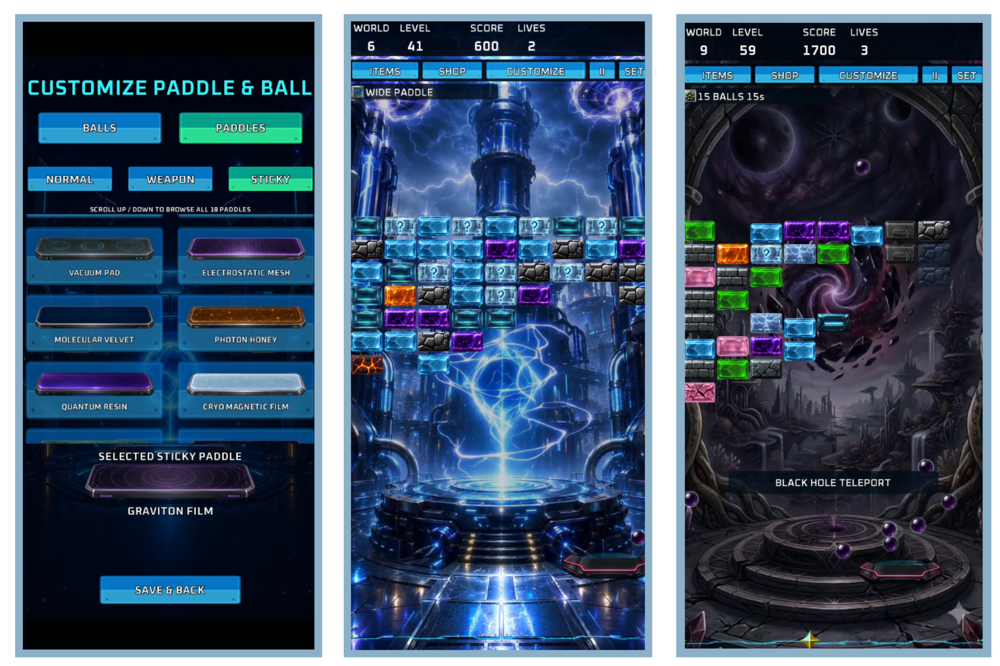
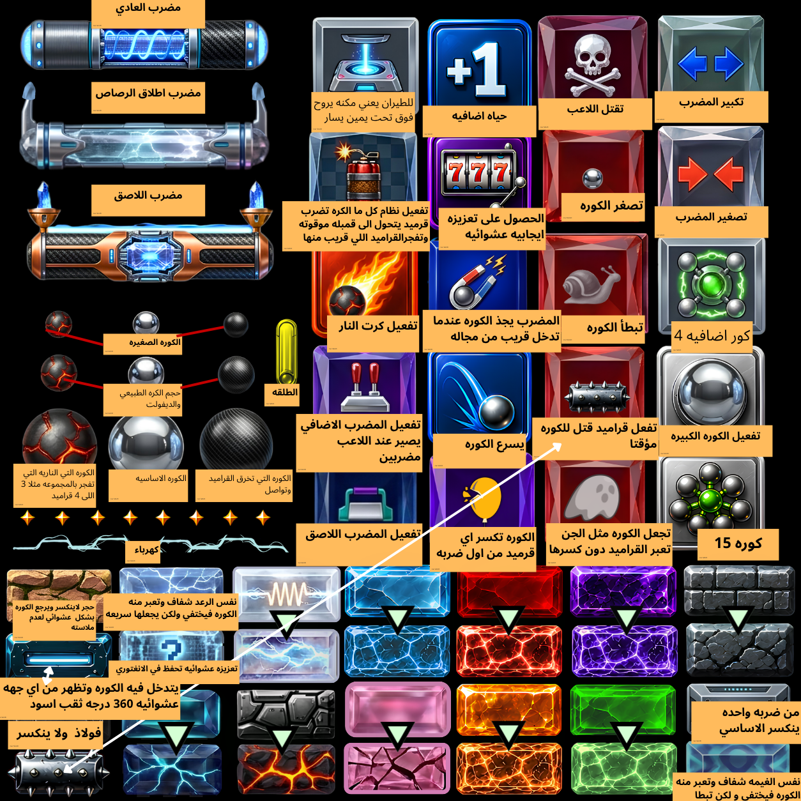
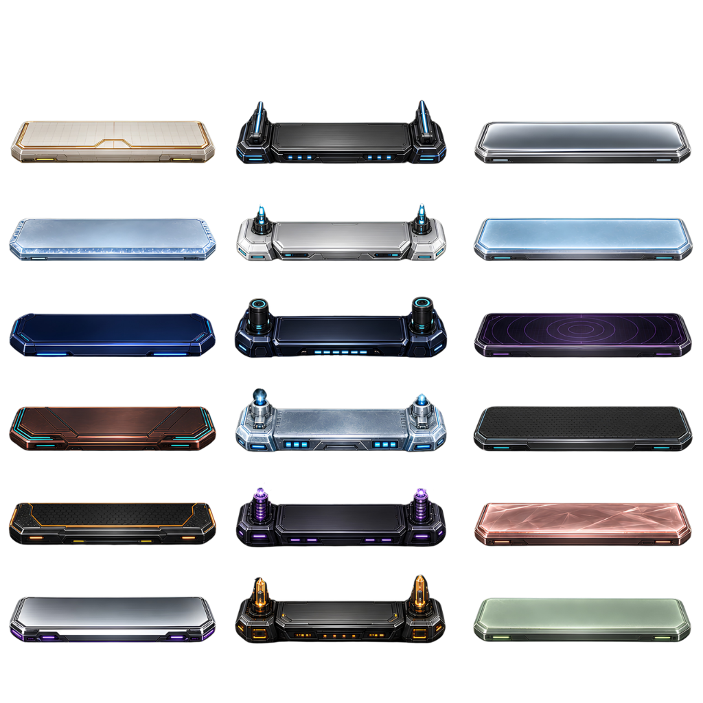
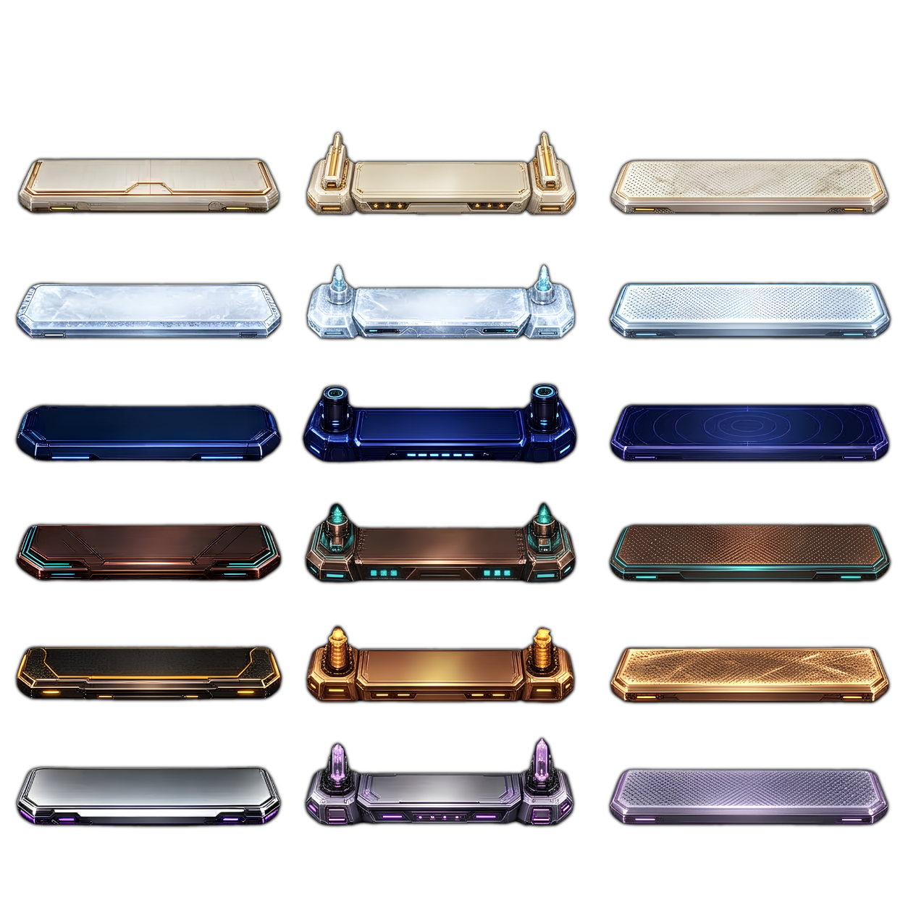
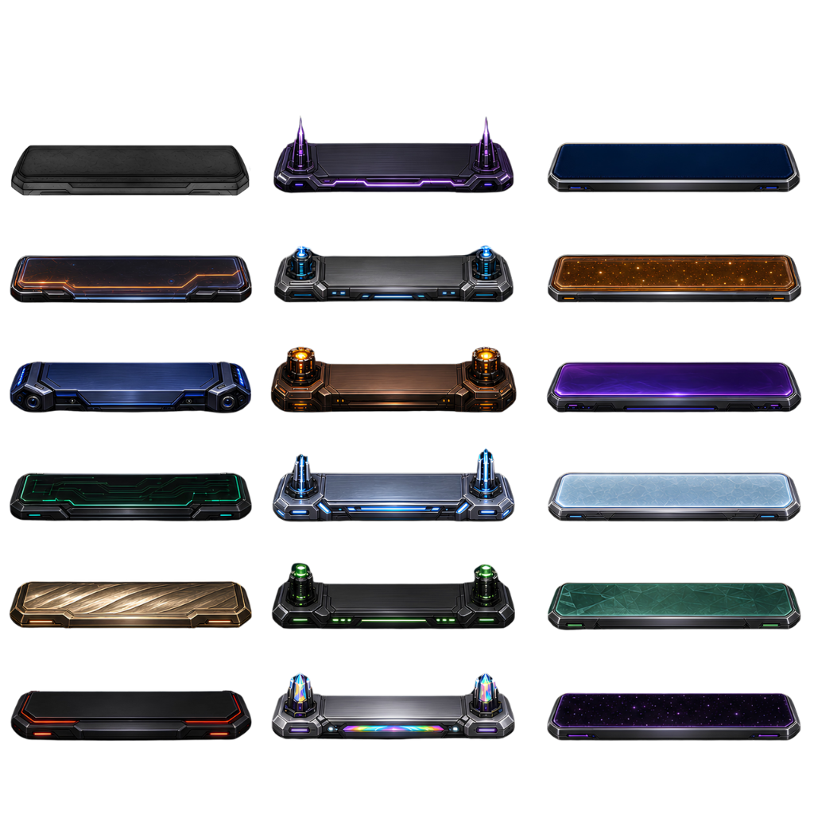
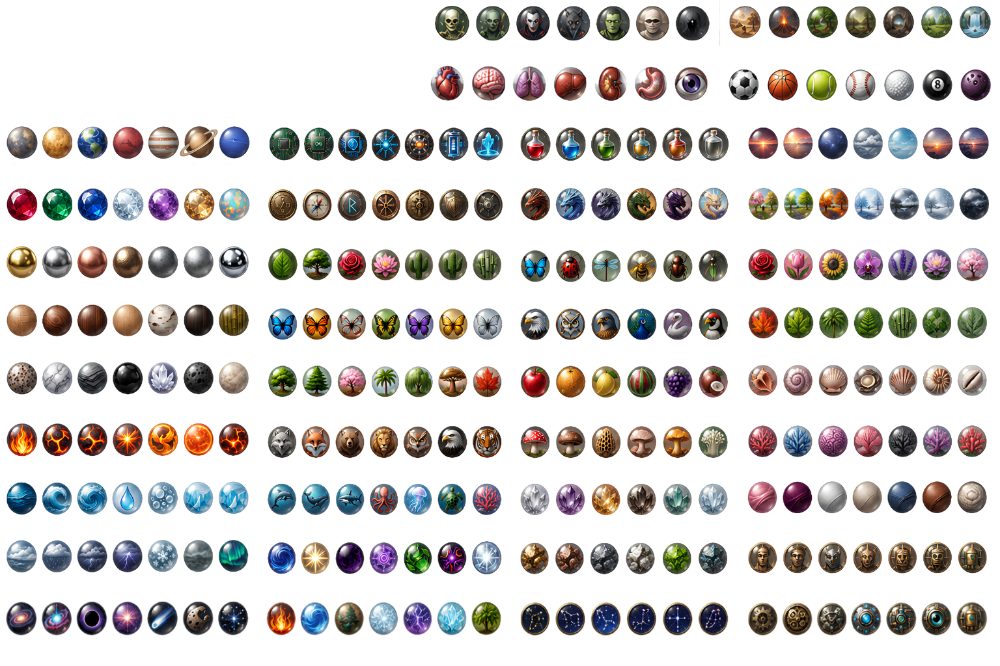

# Brick Breaker Ball

**English** | [العربية](README_AR.md)

Brick Breaker Ball is an Android brick-breaker game written in Kotlin and rendered with LibGDX. The game uses sprite sheets with JSON manifests that define the exact coordinates of each ball and paddle. At runtime, those definitions are converted into LibGDX `TextureRegion` objects; the gameplay UI does not use Android XML, Jetpack Compose, or a WebView.

## Target visual preview

<p align="center">
  
</p>

`the-game.png` is a **461×951** visual reference for the intended gameplay presentation. It shows the top HUD, Items, Shop and Customize controls, active-effect indicators, a world background, the playfield, paddle, balls, and falling items. The image is not loaded by the game code and is not packaged as an APK runtime asset; it documents the target visual direction only.

## Annotated gameplay sprite sheet

<p align="center">
  
</p>

`spritesheet-with-notes.png` is a **1254×1254** annotated visual guide. Its Arabic notes explain the intended behavior of paddles, balls, bricks, and power-ups. This version is for documentation and visual review, not runtime use.

The corresponding canonical runtime source is `spritesheet.png`. Its manifests are stored at:

- `docs/sprite-map-detailed.json`
- `app/src/main/assets/sprites/sprite-map-detailed.json`

The canonical map defines **70 unique regions** inside the 1254×1254 image:

| Category | Count | Purpose |
|---|---:|---|
| Paddles | 3 | Normal, weapon, and sticky paddle states |
| Balls | 9 | Three ball states in three sizes |
| Power-ups | 20 | Positive and negative power-up icons |
| Bricks | 28 | Intact, damaged, and special bricks |
| Effects | 8 | Animated visual-effect frames |
| Projectile | 1 | Weapon-paddle projectile |
| Hazard | 1 | Hazard artwork |

The orange annotations must never be copied into runtime assets. Do not change the canonical sheet dimensions, sprite ordering, or region coordinates without updating the JSON manifests and validation tests together.

## Paddle sprite sheets

The project contains three transparent **1024×1024** PNG sheets. Each sheet contains 18 paddles arranged as six rows of three functional visual types, for a total of **54 paddle sprites**.

| Runtime group | Source image | Coordinate manifest | Count |
|---|---|---|---:|
| `group1` | `app/src/main/assets/sprites/paddles-sprites/paddles-group1.png` | `paddles-group1.json` | 18 |
| `group2` | `app/src/main/assets/sprites/paddles-sprites/paddles-group2.png` | `paddles-group2.json` | 18 |
| `group3` | `app/src/main/assets/sprites/paddles-sprites/paddle-group3.png` | `paddles-group3.json` | 18 |

> Note: the third image is named `paddle-group3.png` in the singular form, while its manifest is named `paddles-group3.json`. This difference is intentional and matches the current runtime loader.

### Paddle types

Every paddle definition uses one of these `group.id` values:

- `normal`: a standard cosmetic paddle.
- `weapon`: the weapon-paddle appearance used while the laser state is active.
- `sticky`: the sticky-paddle appearance used while the sticky state is active.

Selecting a `weapon` or `sticky` cosmetic does not activate that gameplay ability. Abilities are controlled by the canonical power-up system, and the renderer selects the appropriate visual while the related effect is active.

The current default paddles come from group 2:

| State | Stable ID |
|---|---|
| Normal | `group2:paddle_normal_titanium_edge` |
| Weapon | `group2:paddle_weapon_dual_pulse_cannon` |
| Sticky | `group2:paddle_sticky_nano_gel` |

### Group previews

#### Group 1



#### Group 2



#### Group 3



## Cosmetic ball sprite sheet

<p align="center">
  
</p>

`balls-sprites-7.png` is a transparent **1536×1024** PNG described by `balls-sprites-7groups-named.json`. It contains:

- **40 themed groups**.
- **271 uniquely identified ball sprites**.
- Exact `x`, `y`, `width`, and `height` values for every ball.
- Stable group and sprite names used by persistence and session restoration.

The default group and sprite are `monsters` and `monsters_skull`. Other themes include planets, gemstones, metals, woods, fire, water, weather, space, technology, plants, animals, magic, elements, dragons, birds, crystals, constellations, and civilizations.

The cosmetic sprite is separate from the physical collision size. Current logical sizes are:

| Size | Collision radius |
|---|---:|
| Small | 11 |
| Default | 16 |
| Large | 22 |

Raw image dimensions are therefore never used as collision bounds. The renderer scales the selected sprite to match the logical radius. Multi-ball clones preserve their cosmetic identity, logical size, element, and collision mode.

## Runtime loading pipeline

`CosmeticSpriteRepository` performs the following steps:

1. Loads each PNG from `app/src/main/assets/sprites/` through LibGDX.
2. Reads the matching JSON manifest as UTF-8.
3. Verifies that manifest dimensions match the image and that every rectangle remains within bounds.
4. Creates a `TextureRegion` from the exact coordinates of every definition.
5. Applies `Linear` filtering and `ClampToEdge` wrapping to reduce scaling artifacts.
6. Resolves saved ball and paddle selections through stable IDs and falls back to the defaults when a selection is unavailable.

The saved customization keys are `selected_ball_group`, `selected_ball_sprite`, `selected_ball_size`, and `selected_paddle_id`.

## Sprite-sheet editing rules

- Do not change image dimensions, sprite ordering, or coordinates without updating the matching JSON manifest.
- Every sprite must have a unique name or ID and a positive rectangle fully inside the image.
- Keep `spritesheet-with-notes.png` outside `app/src/main/assets`; it is documentation only.
- Never use the yellow ball family as Fire Ball artwork; Fire Ball has a separate representation.
- Do not map unrelated names to the same rectangle unless the relationship is intentional and documented.
- Keep visual sprite size separate from the gameplay collision radius.

## Validation and build

Run these commands from Windows PowerShell:

```powershell
python .agents/skills/sprite-atlas-validator/scripts/validate_atlas.py `
  --image spritesheet.png `
  --manifest docs/sprite-map-detailed.json `
  --expected-count 70

.\gradlew.bat test
.\gradlew.bat lint
.\gradlew.bat assembleRelease
```

`CosmeticCustomizationTest` verifies all 40 ball groups, 271 ball sprites, and 54 paddles. It also checks unique IDs, in-bounds coordinates, persistence, restoration, and the separation between cosmetic selection and gameplay abilities.

## Assets and licensing

Asset origins and license information are documented in [`assets/THIRD_PARTY_ASSETS.md`](assets/THIRD_PARTY_ASSETS.md). Never upload `local.properties`, `keystore.properties`, signing keys, or signing credentials to GitHub; these files are already excluded by `.gitignore`.
