# Brick Breaker Ball

<p align="center">
  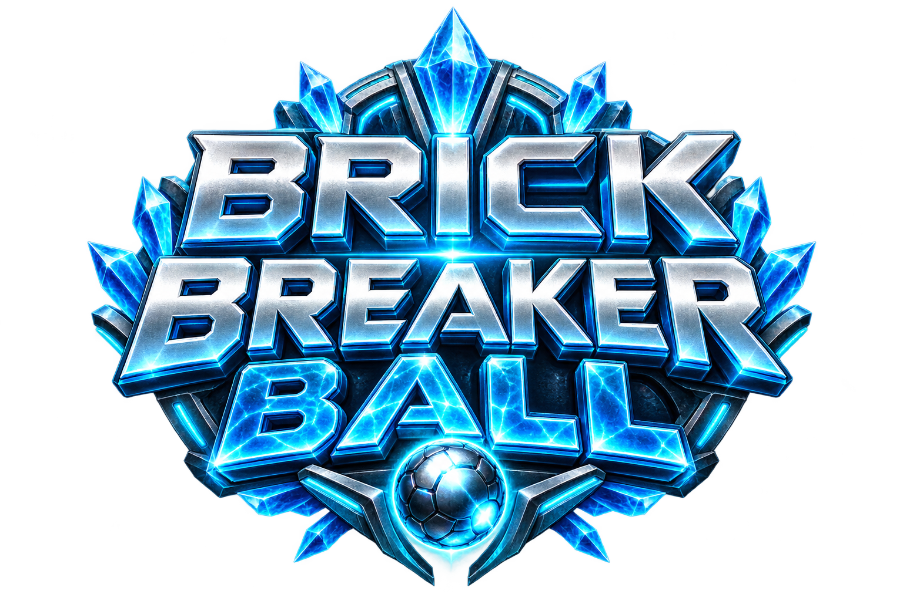
</p>

<p align="center">
  
  
  
  
  
  
  
  
  
  
  
</p>

<p align="center">
  
  
  
  
</p>

## **ForgePulse Games**

**English** | [العربية](README_AR.md)

Brick Breaker Ball is a futuristic Android brick-breaker game written in Kotlin and rendered with LibGDX. This README reflects the current Android app module, gameplay systems, monetization stack, release hardening, and Google Play closed-testing state.

The current module contains **63 Kotlin source/test files**, with LibGDX gameplay, Android platform integration, AdMob rewarded ads, UMP consent, Google Play Billing, Media3 video backgrounds, campaign progression, customization, level editing, persistence, and production-focused R8 verification.
<p>

##  ---> [Watch the Brick Breaker Ball video](https://www.youtube.com/watch?v=xFAEdzZf7L4)  
</p> 

## Current release state

| Area | Current state |
|---|---|
| Google Play | **Closed testing / Alpha 1.0.1 is published to the tester track**; public production release is still pending the closed-test/production-access flow |
| Version | `versionName 1.0.1` / `versionCode 2` |
| Application ID | Production property defaults to `com.forgepulse.brickbreakerball` |
| SDK | `minSdk 24`, `targetSdk 36`, compile SDK 36.1 configuration |
| Campaign | **13 worlds / 90 stages** |
| Cosmetic balls | **105 individual collectible PNG ball cosmetics** |
| Paddle catalog | **6 paddle sheets × 18 sprites = 108 paddle sprites = 36 three-state style sets** |
| Ads | Google Mobile Ads **25.4.0**, two rewarded gateways (revive + talisman), UMP consent **4.0.0** |
| Billing | Google Play Billing **9.1.0**, consumable booster products with recovery/consumption |
| Video backgrounds | Media3/ExoPlayer **1.5.1**, splash + 13 world MP4s |
| Native ABIs | `arm64-v8a`, `armeabi-v7a`, `x86_64` |
| 16 KB page size | Play Console reports **compatible** |
| Login/account | No user login/account system in this module |
| Source manifest permissions | `VIBRATE`, `INTERNET`, `ACCESS_NETWORK_STATE`; SDK manifest merging can add permissions to the final Play bundle |

## Gameplay / systems confirmed from code

- Fixed-step LibGDX brick-breaker simulation with swept collision support.
- 13 named campaign worlds, 90 generated stages, progressive world difficulty and star/score persistence.
- World unlocking, level unlocking and a recommended-next-level path are handled by `ProgressStore`/`LevelRepository`.
- 105 cosmetic balls are unlocked across the campaign; 36 paddle style sets each contain normal, weapon and sticky visuals.
- Ball and paddle ability catalogs give cosmetic collections actual gameplay power profiles.
- Power-ups, charms, inventory boosters, multiball, fire/piercing/size states, lasers, sticky/magnetic paddle behavior, death rail and special/puzzle bricks are implemented in the session layer.
- The level-complete/results flow supports animated reward presentation, including newly unlocked balls/paddle sets.
- Custom level editor with validation, undo/redo, save/load/duplicate/delete and play-test flow.
- Pause-session persistence and custom-level JSON persistence.
- World videos are played underneath the transparent LibGDX surface through AndroidX Media3/ExoPlayer.

## Store, AdMob, consent and billing

The production monetization path is implemented in code rather than mocked:

- `AdMobRewardedAdGateway` uses Google Mobile Ads rewarded ads and tracks `LOADING`, `READY`, `SHOWING`, `UNAVAILABLE` and `DISABLED` states.
- UMP consent is refreshed before the primary rewarded gateway starts requesting ads; privacy options are exposed when required.
- Failed rewarded loads automatically retry after **15 seconds**; consent-blocked preload retries after **1.5 seconds**.
- The app has separate rewarded-ad gateways for **revive** and **talisman/free reward** flows.
- Debug and QA use Google's official sample rewarded-ad IDs; release reads production IDs from Gradle properties and refuses to build with sample IDs.
- `PlayBillingPurchaseGateway` uses BillingClient 9.1.0 with pending one-time purchases enabled, auto service reconnection, localized `ProductDetails`, purchase updates, recovery, and consumption.
- The active shop contains Spark Pack, Power Crate, Full Arsenal and Forge Vault consumables; legacy SKUs remain queryable for safe recovery/consumption.
- AdMob store-link/app verification is still dependent on the game becoming publicly available in a supported store, so closed-test production ad fill can remain limited while AdMob shows review/verification pending.

## R8 / release hardening

R8 is not just enabled in this project; the release pipeline is deliberately built around it.

| Area | Current project configuration |
|---|---|
| Release minification | `isMinifyEnabled = true` |
| Resource shrinking | `isShrinkResources = true` |
| Optimized baseline rules | `proguard-android-optimize.txt` |
| Project rules | `proguard-rules.pro` |
| QA parity | `qa` inherits `release` and also keeps minification/resource shrinking enabled |
| Mapping output | `app/build/outputs/mapping/release/mapping.txt` |
| Native symbol request | `ndk.debugSymbolLevel = "SYMBOL_TABLE"` |
| Assets | `src/main/assets` is not removed by Android resource shrinking |

### What the custom R8 rules preserve

- `SourceFile` and `LineNumberTable` metadata are kept so Play Console stack traces can be retraced with `mapping.txt`; source file names are normalized with `-renamesourcefileattribute SourceFile`.
- The optional libGDX `AndroidFragmentApplication` warning is suppressed.
- JNI methods keep the member names/descriptors required by native libGDX/FreeType entry points.
- `StoredCustomLevel` and `LevelDefinition` are kept (while still allowing optimization) because libGDX JSON accesses their members reflectively and their field names form part of the saved custom-level format.
- `androidx.work.impl.WorkDatabase_Impl` keeps its no-arg constructor because a previous QA/R8 startup path required it during WorkManager initialization.

### Release verification tasks

`assembleRelease` and `bundleRelease` depend on three production guards:

1. **`verifyProductionMonetization`** — validates the production AdMob app ID and both rewarded-ad unit IDs, rejects Google's sample IDs, and requires `productionAdsAudienceReviewed=true`.
2. **`verifyProductionSourceSafety`** — verifies that developer access is disabled by default in release and that menu/shop developer paths remain BuildConfig-gated.
3. **`verifyReleaseSigning`** — validates the permanent application ID, HTTPS privacy-policy URL, keystore file and all required signing properties.

### Latest Play Console result reached in this release cycle

The uploaded Alpha bundle was reported by Play Console as **R8 full mode**, with **94% optimization**, **94% key/name obfuscation**, **94% code shrinking**, optimized resource shrinking/class repackaging, and **5.83 MB uncompressed DEX**. The bundle is also reported compatible with **16 KB memory pages**.

> The `SYMBOL_TABLE` setting asks AGP to package native symbol-table metadata when available. Prebuilt libGDX `.so` libraries can already be stripped, so native debug-symbol completeness depends on what those upstream binaries contain; this is separate from the Java/Kotlin R8 `mapping.txt` file.

## Visuals

<p align="center">
  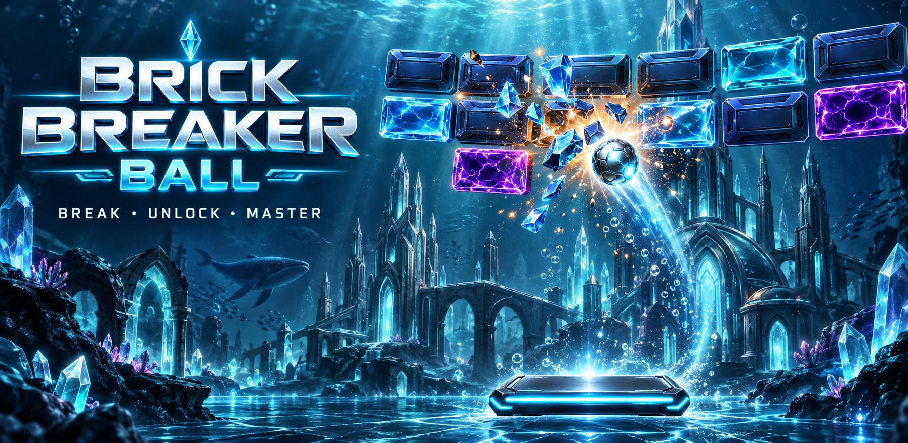
</p>

### Gameplay screenshots

<p align="center">
  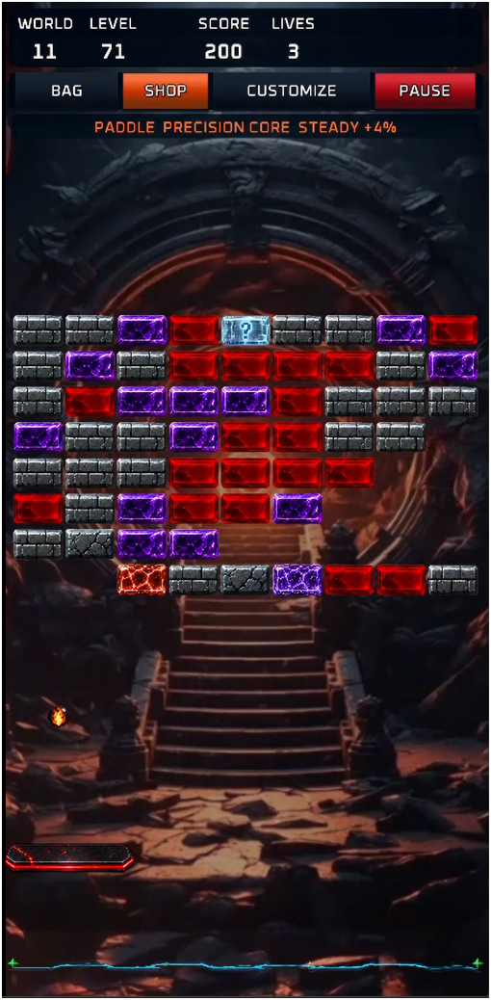
  ---
  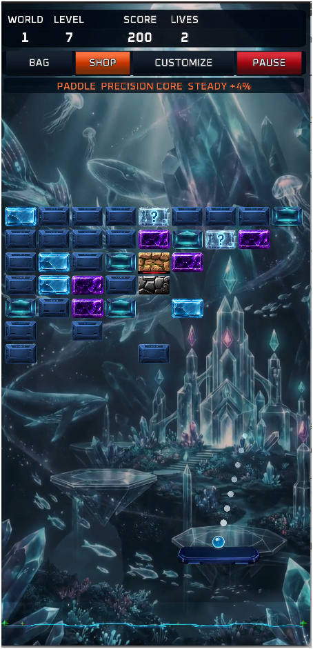
  ---
  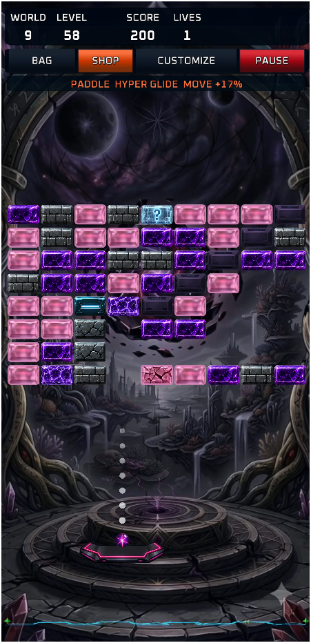
</p>

### Canonical gameplay sprite sheet

<p align="center">
  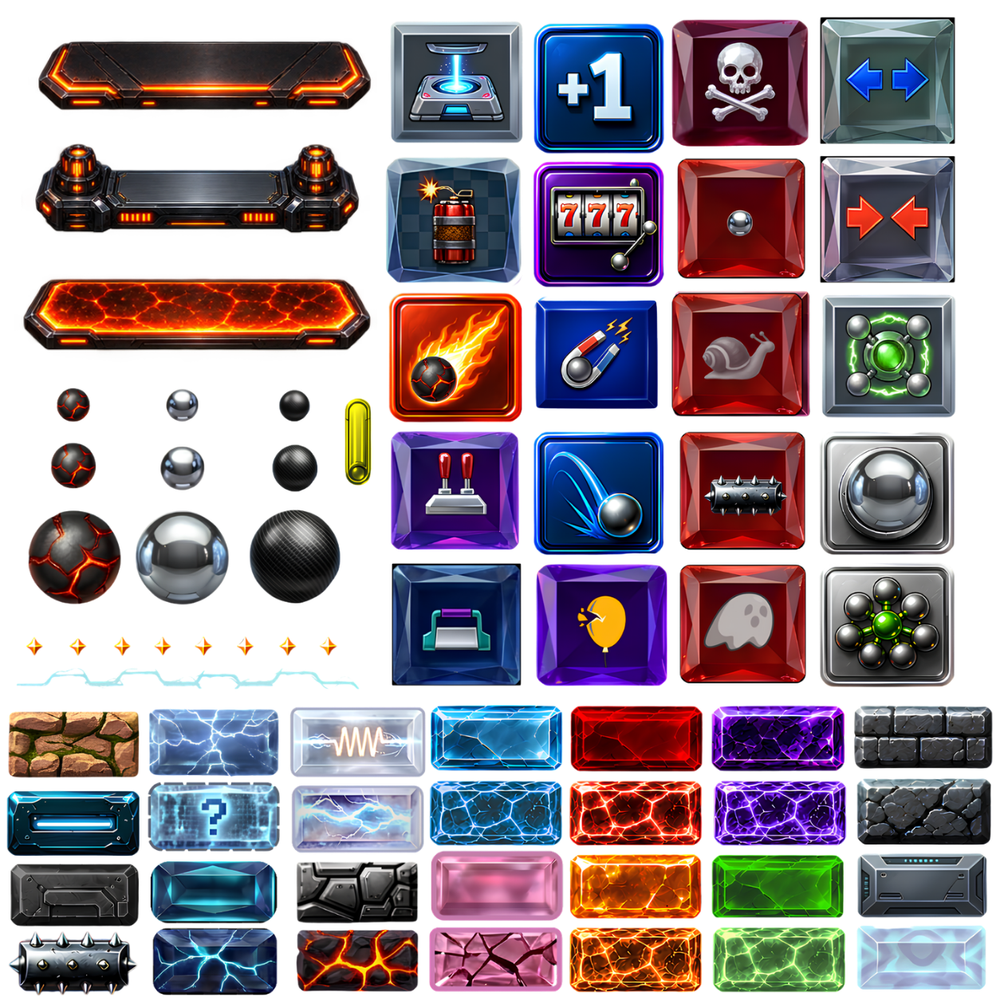
</p>

The runtime canonical copy is `app/src/main/assets/sprites/spritesheet.png`, with coordinates in `sprite-map-detailed.json`.

### Paddle sheet previews

| Group | Preview |
|---|---|
| 1 | 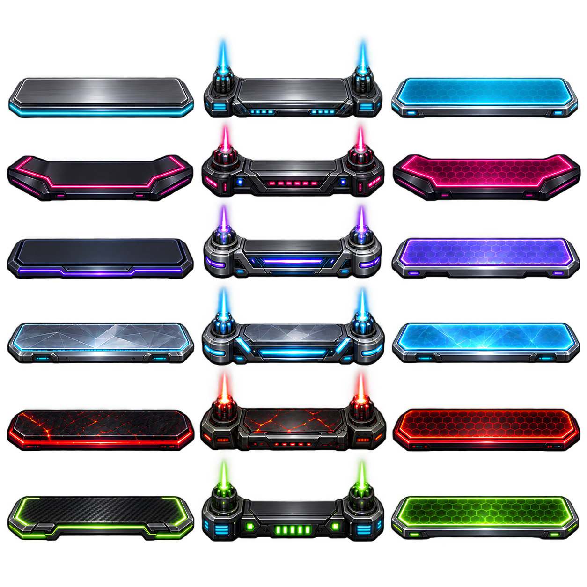 |
| 2 |  |
| 3 |  |
| 4 | 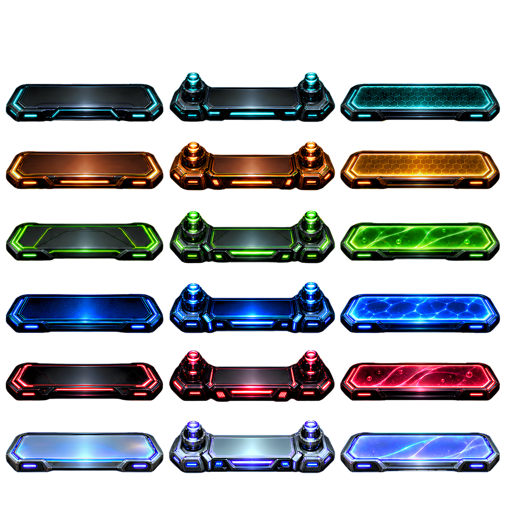 |
| 5 | 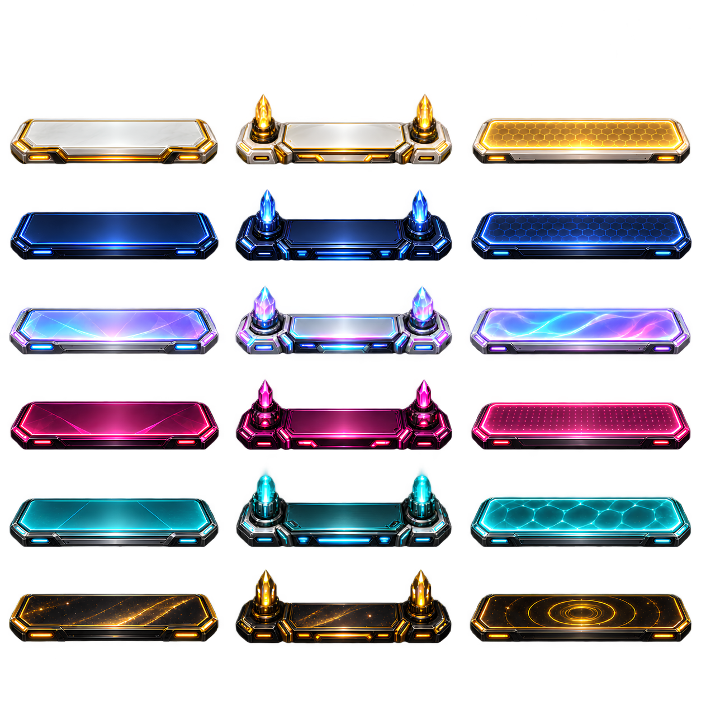 |
| 6 | 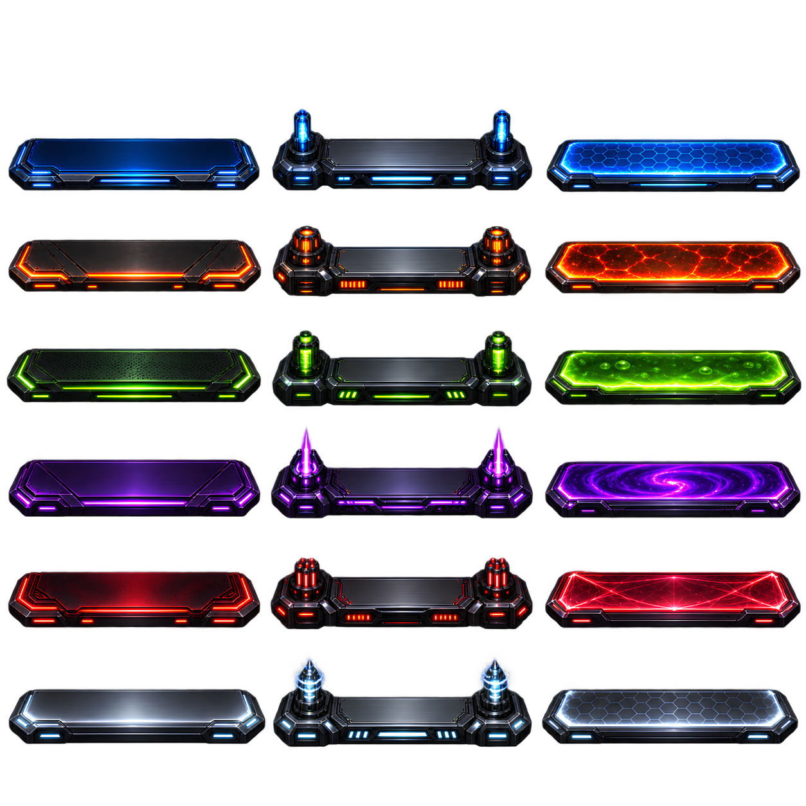 |

### Cosmetic ball sheet

<p align="center">
  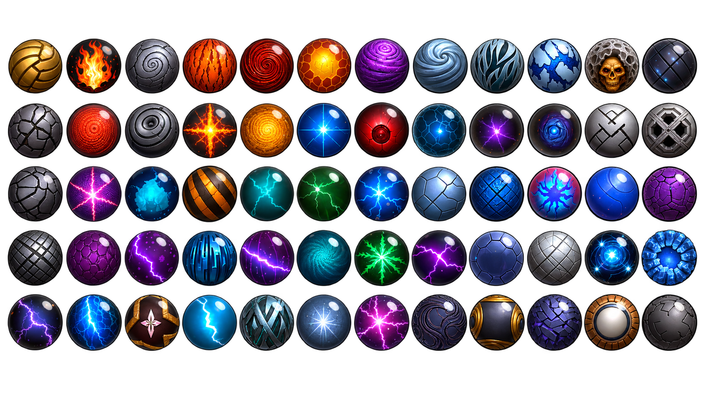
</p>

## Build and validation

```powershell
.\gradlew.bat spotlessCheck
.\gradlew.bat test
.\gradlew.bat lint
.\gradlew.bat assembleQa
.\gradlew.bat clean bundleRelease
```

`qa` is intentionally production-like for R8/resource shrinking but uses debug signing and Google test ad IDs. `bundleRelease` cannot complete unless production monetization, source safety and signing checks pass.

### Release outputs

```text
AAB:     app/build/outputs/bundle/release/app-release.aab
Mapping: app/build/outputs/mapping/release/mapping.txt
```

## Kotlin source reference

Only Kotlin program/test files are listed in the collapsible reference below. Binary assets, Android resources, native libraries, JSON, audio, video, fonts, shaders, and generated files are intentionally omitted from this section.

### Runtime / production Kotlin (41)

<details>
<summary><code>src/main/java/com/example/brick_breaker_ball/AndroidMonetization.kt</code></summary>

Android implementations of rewarded AdMob/UMP consent and Google Play Billing. Handles rewarded-ad preload/show/retry, privacy options, ProductDetails, purchases, recovery and consumption.

**Primary types:** `AdMobRewardedAdGateway`, `PlayBillingPurchaseGateway`

**Representative functions:** `refreshConsent`, `preload`, `onAdLoaded`, `onAdFailedToLoad`, `show`, `onAdDismissedFullScreenContent`, `onAdFailedToShowFullScreenContent`, `showPrivacyOptions`, `startAdsIfAllowed`, `dispose` …

</details>

<details>
<summary><code>src/main/java/com/example/brick_breaker_ball/BallAbilities.kt</code></summary>

Defines ball ability kinds/profiles and maps the 105 cosmetic balls to gameplay power profiles, tiers, stats and archetypes.

**Primary types:** `BallAbilityKind`, `BallAbilityProfile`, `BallAbilityCatalog`

**Representative functions:** `shortStat`, `ballNumber`, `profileForBall`, `profileForSprite`, `profile`, `profileForArchetype`

</details>

<details>
<summary><code>src/main/java/com/example/brick_breaker_ball/BoosterStores.kt</code></summary>

Persistence and bookkeeping for booster inventory, processed transactions and daily rewarded-ad limits/cooldowns.

**Primary types:** `BoosterInventoryStore`, `TransactionLedger`, `DailyRewardStore`

**Representative functions:** `count`, `snapshot`, `add`, `addAll`, `consume`, `refund`, `clearForTests`, `total`, `hasProcessed`, `markProcessed` …

</details>

<details>
<summary><code>src/main/java/com/example/brick_breaker_ball/BrickBreakerGame.kt</code></summary>

Top-level LibGDX Game coordinator. Creates assets/progression/services, switches screens, starts/resumes sessions, reconciles purchases and applies audio settings.

**Primary types:** `BrickBreakerGame`

**Representative functions:** `create`, `setScreen`, `openMenu`, `applyAudioSettings`, `play`, `playCustom`, `resumePausedGame`, `startNewGame`, `reconcilePurchases`, `resume` …

</details>

<details>
<summary><code>src/main/java/com/example/brick_breaker_ball/Campaign.kt</code></summary>

Campaign/world/level definitions and progression store. Contains 13 worlds, 90 generated campaign stages, difficulty scaling, star/score persistence, unlock rules and settings persistence.

**Primary types:** `WorldDefinition`, `LevelDefinition`, `LevelRepository`, `ValidationResult`, `LevelValidator`, `GraphicsQuality`, `GameSettings`, `ProgressStore`

**Representative functions:** `level`, `worldLevelCount`, `firstLevel`, `lastLevel`, `worldForLevel`, `isBonusStage`, `createLevel`, `key`, `place`, `worldMaterials` …

</details>

<details>
<summary><code>src/main/java/com/example/brick_breaker_ball/CampaignBrickPalette.kt</code></summary>

Maps world/brick combinations to sprite IDs and normal/color-blind tints for campaign rendering.

**Representative functions:** `spriteFor`, `tintFor`, `colorBlindTintFor`, `palette`

</details>

<details>
<summary><code>src/main/java/com/example/brick_breaker_ball/CharmsBagScreen.kt</code></summary>

Interactive charms/inventory screen with tabs, scrolling, item cards, descriptions and item activation.

**Primary types:** `CharmsBagScreen`

**Representative functions:** `show`, `hide`, `render`, `drawSelectedCharm`, `drawActions`, `drawAction`, `drawTab`, `drawCharmCard`, `handleInput`, `handleMouseWheel` …

</details>

<details>
<summary><code>src/main/java/com/example/brick_breaker_ball/CosmeticDetailScreens.kt</code></summary>

Dedicated ball and paddle power-detail screens that render clean previews, ability data and paddle-state sets.

**Primary types:** `BallPowerDetailScreen`, `PaddlePowerDetailScreen`

**Representative functions:** `render`, `drawBallClean`, `smooth`, `drawPaddleFit`

</details>

<details>
<summary><code>src/main/java/com/example/brick_breaker_ball/CosmeticModels.kt</code></summary>

Cosmetic data models, defaults, paddle visual slots/layouts and construction of three-state paddle style sets.

**Primary types:** `BallSpriteDefinition`, `PaddleSpriteDefinition`, `CosmeticDefaults`, `CosmeticPaddleSelection`, `PaddleVisualSlot`, `PaddleVisualLayout`, `PaddleStyleSet`, `PaddleStyleCatalog`

**Representative functions:** `idForState`, `slots`, `contains`, `build`, `styleForPaddle`

</details>

<details>
<summary><code>src/main/java/com/example/brick_breaker_ball/CosmeticProgression.kt</code></summary>

Ownership and campaign unlock progression for balls and paddle styles. Reconciles unlocks from completed stages and enforces owned-only equipment outside developer builds.

**Primary types:** `CosmeticUnlock`, `Ball`, `Paddle`, `CosmeticOwnershipStore`, `CosmeticProgressionService`

**Representative functions:** `ownsBall`, `ownsPaddleStyle`, `unlockBall`, `unlockPaddleStyle`, `reconcile`, `onCampaignResult`, `ownsPaddle`, `styleForPaddle`, `ownedBallCount`, `totalBallCount` …

</details>

<details>
<summary><code>src/main/java/com/example/brick_breaker_ball/CosmeticSpriteRepository.kt</code></summary>

Loads cosmetic ball/paddle assets and JSON manifests, validates regions, creates TextureRegions, resolves saved selections and disposes textures.

**Primary types:** `PaddleSheetAsset`, `CosmeticSpriteCatalogParser`, `CosmeticSpriteRepository`

**Representative functions:** `paddles`, `paddleName`, `paddleDisplayName`, `slug`, `paddleSheets`, `requireInBounds`, `ballDefinition`, `paddleDefinition`, `ballRegion`, `paddleRegion` …

</details>

<details>
<summary><code>src/main/java/com/example/brick_breaker_ball/CosmeticUnlockRevealScreen.kt</code></summary>

Animated standalone cosmetic reveal flow with ball/paddle previews, equip/continue/skip behavior and reward sequencing.

**Primary types:** `CosmeticRevealKind`, `CosmeticRevealFlow`, `CosmeticUnlockRevealScreen`

**Representative functions:** `advance`, `skip`, `render`, `revealPanel`, `drawBall`, `drawPaddleStyle`, `drawBallPreview`, `croppedBallPreviewRegion`, `drawEnergy`, `isBallEquipped` …

</details>

<details>
<summary><code>src/main/java/com/example/brick_breaker_ball/CustomizationScreen.kt</code></summary>

Balls/paddles customization UI with ownership filtering, scrolling, selection, previews, detail-screen navigation and equip state.

**Primary types:** `CustomizationTab`, `CustomizationScreen`

**Representative functions:** `visiblePaddleCard`, `visibleBallCard`, `show`, `hide`, `render`, `drawBalls`, `drawPaddles`, `orderedPaddles`, `selectedPaddleId`, `setSelectedPaddleId` …

</details>

<details>
<summary><code>src/main/java/com/example/brick_breaker_ball/DetailedSpriteSheet.kt</code></summary>

Parser/runtime wrapper for the canonical detailed gameplay sprite map, including region lookup and state transitions.

**Primary types:** `SpriteId`, `SpriteMetadata`, `DetailedSpriteSheet`

**Representative functions:** `from`, `region`, `nextState`, `previousState`, `dispose`

</details>

<details>
<summary><code>src/main/java/com/example/brick_breaker_ball/DevelopmentAccess.kt</code></summary>

Build-gated developer access switch used only where BuildConfig allows it; controls test access to levels/worlds/cosmetics/purchases.

**Primary types:** `DevelopmentAccess`

**Representative functions:** `toggle`, `canSelectLevel`, `canSelectWorld`, `canUseCosmetic`, `canMakeTestPurchase`

</details>

<details>
<summary><code>src/main/java/com/example/brick_breaker_ball/ForgeUiPalette.kt</code></summary>

Central color constants used by the Forge-style UI.

**Primary types:** `ForgeUiPalette`

</details>

<details>
<summary><code>src/main/java/com/example/brick_breaker_ball/ForgeUiRenderer.kt</code></summary>

Procedural gradient/rounded button, panel, border and progress rendering utilities with cached generated textures.

**Primary types:** `ForgeUiRenderer`, `GradientStyle`

**Representative functions:** `drawGradientButton`, `drawRoundedGradientButton`, `drawCompactRoundedGradientButton`, `drawGradientPanel`, `drawGradientBorderPanel`, `drawGradientProgress`, `dispose`, `drawGradient`, `drawRoundedGradient`, `drawCompactRoundedGradient` …

</details>

<details>
<summary><code>src/main/java/com/example/brick_breaker_ball/ForgeUiTheme.kt</code></summary>

Shared UI dimensions/style constants for the Forge visual theme.

**Primary types:** `ForgeUiTheme`

</details>

<details>
<summary><code>src/main/java/com/example/brick_breaker_ball/GameAssets.kt</code></summary>

Central LibGDX asset owner for fonts, audio, menu textures, gameplay music, atlases, backgrounds and cosmetic assets.

**Primary types:** `GameAssets`

**Representative functions:** `gameplayMusicPathForWorld`, `font`, `play`, `worldFallbackBg`, `worldMapImage`, `startMenuTexture`, `pauseMenuTexture`, `settingsMenuTexture`, `startMenuMusic`, `stopMenuMusic` …

</details>

<details>
<summary><code>src/main/java/com/example/brick_breaker_ball/GameModels.kt</code></summary>

Core gameplay data types: phases, ball/paddle states, brick types, falling items, laser shots, feedback events and fixed-step loop primitives.

**Primary types:** `GamePhase`, `BallElement`, `BallCollisionMode`, `BallSize`, `PaddleMode`, `BrickType`, `DamageStage`, `Paddle`, `Ball`, `Brick`, `FallingPowerUp`, `LaserShot`

**Representative functions:** `smaller`, `larger`, `megaBoosted`, `fromRadius`, `animate`, `advance`

</details>

<details>
<summary><code>src/main/java/com/example/brick_breaker_ball/GameScreen.kt</code></summary>

Main gameplay screen. Renders world/playfield/HUD, handles pause/inventory/game-over input, level completion, rewarded continue and responsive layout.

**Primary types:** `GameScreen`

**Representative functions:** `requiresGameplayBallSprite`, `render`, `drawLevelCompleteTransition`, `brick`, `paddle`, `ball`, `aimGuide`, `hud`, `activeEffectsHud`, `drawHudCell` …

</details>

<details>
<summary><code>src/main/java/com/example/brick_breaker_ball/GameSession.kt</code></summary>

Core gameplay simulation and rules: ball physics, swept collisions, brick damage, power-ups, capsules, laser/paddle abilities, scoring/lives and session updates.

**Primary types:** `BoosterUseResult`, `Applied`, `Rejected`, `GameSession`

**Representative functions:** `newLevel`, `serve`, `createBall`, `activeElement`, `applyCustomization`, `clampPaddleForActiveLayout`, `action`, `armPaddleAbility`, `paddleAbilityStatus`, `hasAttachedBalls` …

</details>

<details>
<summary><code>src/main/java/com/example/brick_breaker_ball/GameplayAtlas.kt</code></summary>

Lookup layer for canonical gameplay sprites such as balls, bricks, paddles and power-up previews.

**Primary types:** `PaddleSkin`, `GameplayAtlas`

**Representative functions:** `ball`, `brick`, `preview`, `intactBrickId`, `powerUpIcon`

</details>

<details>
<summary><code>src/main/java/com/example/brick_breaker_ball/GameplayTuning.kt</code></summary>

Gameplay tuning constants used by the simulation for speeds, sizes, timings and balance values.

**Primary types:** `GameplayTuning`

</details>

<details>
<summary><code>src/main/java/com/example/brick_breaker_ball/LevelEditorModels.kt</code></summary>

Custom-level editor models, undo/redo state, brick codec/info and on-device custom-level repository with JSON persistence.

**Primary types:** `BrickCodec`, `EditorTool`, `PaletteSection`, `BrickInfo`, `BrickInfoRepository`, `EditorCell`, `LevelProperties`, `LevelEditorState`, `StoredCustomLevel`, `CustomLevelRepository`

**Representative functions:** `symbol`, `type`, `key`, `from`, `beginStroke`, `paint`, `endStroke`, `fill`, `clear`, `mutateProperties` …

</details>

<details>
<summary><code>src/main/java/com/example/brick_breaker_ball/LevelEditorScreen.kt</code></summary>

Visual level editor UI for grid painting, palette, properties, save/load/duplicate/delete/play and validation dialogs.

**Primary types:** `LevelEditorScreen`

**Representative functions:** `render`, `drawGrid`, `handleGridInput`, `gridAtTouch`, `drawPalette`, `handlePaletteInput`, `compactBrickDescription`, `drawProperties`, `handlePropertiesInput`, `hit` …

</details>

<details>
<summary><code>src/main/java/com/example/brick_breaker_ball/MainActivity.kt</code></summary>

Android host activity. Creates the LibGDX view, ExoPlayer world-video layer, Play Billing and two rewarded AdMob gateways, then binds lifecycle handling.

**Primary types:** `MainActivity`

**Representative functions:** `onCreate`, `playWorldVideo`, `stopWorldVideo`, `onPause`, `onResume`, `onDestroy`

</details>

<details>
<summary><code>src/main/java/com/example/brick_breaker_ball/MonetizationServices.kt</code></summary>

Platform-neutral monetization interfaces/results and service container for Play Billing plus rewarded-ad gateways.

**Primary types:** `PurchaseResult`, `Success`, `Pending`, `Cancelled`, `Failed`, `RecoveredPurchase`, `PurchaseGateway`, `AdState`, `RewardedAdResult`, `Earned`, `ClosedWithoutReward`, `RewardedAdGateway`

**Representative functions:** `purchase`, `price`, `refreshProducts`, `reconcile`, `dispose`, `show`, `preload`, `showPrivacyOptions`, `refreshConsent`, `earn` …

</details>

<details>
<summary><code>src/main/java/com/example/brick_breaker_ball/PaddleAbilities.kt</code></summary>

Defines paddle ability kinds/profiles and maps normal paddle style IDs to gameplay powers and tiers.

**Primary types:** `PaddleAbilityKind`, `PaddleAbilityProfile`, `PaddleAbilityCatalog`

**Representative functions:** `profileForNormalPaddle`, `profile`, `knownNormalPaddleIds`, `profileForArchetype`

</details>

<details>
<summary><code>src/main/java/com/example/brick_breaker_ball/PausedSessionStore.kt</code></summary>

Serializes/restores the paused campaign session state and clears it when no longer needed.

**Primary types:** `PausedSessionStore`

**Representative functions:** `hasPausedGame`, `save`, `restore`, `clear`

</details>

<details>
<summary><code>src/main/java/com/example/brick_breaker_ball/PowerUpInfoRepository.kt</code></summary>

Human-readable names/descriptions for power-up types, including legacy description compatibility.

**Primary types:** `PowerUpInfo`, `PowerUpInfoRepository`

**Representative functions:** `info`, `legacyDescription`

</details>

<details>
<summary><code>src/main/java/com/example/brick_breaker_ball/PowerUps.kt</code></summary>

Power-up definitions, categories, drop director and active-effect manager including persistence/restore rules.

**Primary types:** `PowerUpCategory`, `EffectScope`, `StackPolicy`, `CapsuleStyle`, `PowerUpType`, `PowerUpDefinition`, `PowerUpCatalog`, `PowerUpDropDirector`, `PowerUpManager`

**Representative functions:** `worldDropTypes`, `update`, `choose`, `activate`, `deactivate`, `clearLifeScoped`, `clear`, `persistentSnapshot`, `restorePersistent`, `activeEffects` …

</details>

<details>
<summary><code>src/main/java/com/example/brick_breaker_ball/PrivacyPolicyScreen.kt</code></summary>

In-game privacy-policy reader with clipping, scrolling and back navigation.

**Primary types:** `PrivacyPolicyScreen`

**Representative functions:** `render`, `beginTextClip`, `endTextClip`, `handleScroll`, `drawScrollTrack`, `goBack`

</details>

<details>
<summary><code>src/main/java/com/example/brick_breaker_ball/Replay.kt</code></summary>

Lightweight replay input/data structures and recorder for captured gameplay inputs.

**Primary types:** `ReplayInput`, `ReplayData`, `ReplayRecorder`

**Representative functions:** `record`, `snapshot`

</details>

<details>
<summary><code>src/main/java/com/example/brick_breaker_ball/RewardRevealScreen.kt</code></summary>

Persistence and display of pending reward reveals across screen/session transitions.

**Primary types:** `PendingReward`, `PendingRewardRevealStore`, `RewardRevealScreen`

**Representative functions:** `save`, `load`, `clear`, `render`

</details>

<details>
<summary><code>src/main/java/com/example/brick_breaker_ball/RulesScreen.kt</code></summary>

In-game game-rules/documentation viewer that parses headings, paragraphs, inline highlights and image blocks with scrolling.

**Primary types:** `Heading`, `Paragraph`, `Image`, `Spacer`, `RulesScreen`

**Representative functions:** `scrolled`, `render`, `show`, `hide`, `updateSmoothScroll`, `drawRules`, `withPanelClip`, `drawHeading`, `drawParagraph`, `parseInlineTokens` …

</details>

<details>
<summary><code>src/main/java/com/example/brick_breaker_ball/ShopModels.kt</code></summary>

Shop catalog and grant logic. Defines four active consumable bundles, legacy SKUs for recovery, localized-price UI state and deterministic booster grants.

**Primary types:** `ShopProductId`, `BoosterGrant`, `RandomTotal`, `EachType`, `EachTypePlusRandom`, `ShopProduct`, `ShopProductUiState`, `ShopCatalog`, `BoosterGrantFactory`, `DailyRewardState`

**Representative functions:** `shopProductUiState`, `findByStoreId`, `createGrant`, `randomGrant`, `reward`, `dayKey`

</details>

<details>
<summary><code>src/main/java/com/example/brick_breaker_ball/ShopScreen.kt</code></summary>

Shop UI for featured packs, paddles, balls, items and free rewarded rewards; integrates Play Billing prices/purchases and rewarded ads.

**Primary types:** `ShopReturnDestination`, `ShopScreen`

**Representative functions:** `show`, `hide`, `render`, `beginStore`, `drawHeader`, `drawTabs`, `drawSectionTitle`, `scrollOffset`, `maxScrollOffset`, `updateScrollDrag` …

</details>

<details>
<summary><code>src/main/java/com/example/brick_breaker_ball/SweptCollision.kt</code></summary>

Swept circle-versus-AABB collision helper used to reduce tunneling at higher ball speeds.

**Primary types:** `CollisionResult`, `SweptCollision`

**Representative functions:** `circleVsAabb`

</details>

<details>
<summary><code>src/main/java/com/example/brick_breaker_ball/UiScreens.kt</code></summary>

Shared LibGDX screens and UI flows: splash, main menu, world map, level select, results, custom-test result and settings; includes animated level-complete rewards.

**Primary types:** `ForgeScreen`, `SplashScreen`, `MainMenuScreen`, `WorldMapScreen`, `LevelSelectScreen`, `ResultsScreen`, `CustomTestResultScreen`, `SettingsScreen`

**Representative functions:** `installMouseWheelHandler`, `scrolled`, `removeMouseWheelHandler`, `drawFullscreen`, `drawFullscreenPanel`, `begin`, `title`, `button`, `drawLockBadge`, `fittedText` …

</details>

<details>
<summary><code>src/main/java/com/example/brick_breaker_ball/WorldVideoBackgrounds.kt</code></summary>

Bridge between LibGDX screens and Android ExoPlayer. Maps the 13 campaign worlds plus splash to MP4 background assets.

**Primary types:** `WorldVideoBackgrounds`

**Representative functions:** `assetForWorld`, `isVideoVisible`, `showAsset`

</details>

### Unit-test Kotlin (21)

<details>
<summary><code>src/test/java/com/example/brick_breaker_ball/BallAbilityTest.kt</code></summary>

Verifies ball ability catalog/profile behavior and power mapping.

**Primary types:** `BallAbilityTest`

**Representative functions:** `allOneHundredFiveNumberedBallsHaveAValidPowerProfile`, `fiveProgressionTiersCoverTwentyOneBallsEach`, `sevenAbilityArchetypesRepeatInStableOrder`, `highNumberBallSpritesUseThreeDigitCatalogNumbers`

</details>

<details>
<summary><code>src/test/java/com/example/brick_breaker_ball/CampaignBrickPaletteTest.kt</code></summary>

Verifies campaign brick sprite/tint palette mappings.

**Primary types:** `CampaignBrickPaletteTest`

</details>

<details>
<summary><code>src/test/java/com/example/brick_breaker_ball/CampaignProgressionTest.kt</code></summary>

Verifies world/level unlock progression and campaign completion rules.

**Primary types:** `CampaignProgressionTest`

</details>

<details>
<summary><code>src/test/java/com/example/brick_breaker_ball/CosmeticCustomizationTest.kt</code></summary>

Validates cosmetic ball/paddle catalogs, IDs, selection and persistence behavior.

**Primary types:** `CosmeticCustomizationTest`

**Representative functions:** `parsePaddles`

</details>

<details>
<summary><code>src/test/java/com/example/brick_breaker_ball/CosmeticSetProgressionTest.kt</code></summary>

Verifies cosmetic unlock milestones and paddle-style set progression.

**Primary types:** `CosmeticSetProgressionTest`

**Representative functions:** `ball`, `style`, `paddle`, `fixture`

</details>

<details>
<summary><code>src/test/java/com/example/brick_breaker_ball/DetailedSpriteManifestTest.kt</code></summary>

Validates the canonical detailed sprite manifest structure and mapped regions.

**Primary types:** `DetailedSpriteManifestTest`

</details>

<details>
<summary><code>src/test/java/com/example/brick_breaker_ball/DevelopmentAccessTest.kt</code></summary>

Verifies developer-access gating and disabled production behavior.

**Primary types:** `DevelopmentAccessTest`

**Representative functions:** `debugModeBypassesSelectionLocksWithoutChangingProgress`, `releaseModeIgnoresPreviouslyEnabledPreference`

</details>

<details>
<summary><code>src/test/java/com/example/brick_breaker_ball/GameLogicTest.kt</code></summary>

General unit tests for core gameplay/session logic.

**Primary types:** `GameLogicTest`

**Representative functions:** `playingSession`, `collisionSession`, `hitBrick`

</details>

<details>
<summary><code>src/test/java/com/example/brick_breaker_ball/GameplayRulesRegressionTest.kt</code></summary>

Regression coverage for gameplay rules that must remain stable across changes.

**Primary types:** `GameplayRulesRegressionTest`

**Representative functions:** `levelWith`, `stageOneHasNoExplosiveTeachingTrap`, `megaBallIsVisiblyMega`, `piercingBallCanDestroySteelAndContinue`, `laserShotsInheritFireAndPiercingEffects`, `losingALifeClearsTemporaryEffectsAndFallingTalismans`

</details>

<details>
<summary><code>src/test/java/com/example/brick_breaker_ball/LevelEditorTest.kt</code></summary>

Verifies editor state, brick encoding, undo/redo and custom-level behavior.

**Primary types:** `LevelEditorTest`

**Representative functions:** `level`

</details>

<details>
<summary><code>src/test/java/com/example/brick_breaker_ball/NewSpriteGameplayTest.kt</code></summary>

Regression tests for gameplay behavior using the newer sprite/asset pipeline.

**Primary types:** `NewSpriteGameplayTest`

**Representative functions:** `playing`, `sentinel`, `collisionGame`, `hitUp`, `advance`

</details>

<details>
<summary><code>src/test/java/com/example/brick_breaker_ball/PaddleAbilityTest.kt</code></summary>

Verifies paddle ability profiles and runtime behavior.

**Primary types:** `PaddleAbilityTest`

**Representative functions:** `everyPaddleStyleHasAStableAbility`, `firstFourStylesMatchDesignedProgression`, `hyperGlideMovesPaddleFasterThanStarter`, `impactBoostTapArmsShortPerfectWindow`, `pausedSessionPreservesAbilityStateAndFireCharge`

</details>

<details>
<summary><code>src/test/java/com/example/brick_breaker_ball/Phase1PowerUpTest.kt</code></summary>

Verifies the first group of power-up behaviors and interactions.

**Primary types:** `Phase1PowerUpTest`

**Representative functions:** `configured`, `playing`, `sentinel`, `collisionGame`, `hitUp`, `advance`

</details>

<details>
<summary><code>src/test/java/com/example/brick_breaker_ball/ProductionEnhancementsTest.kt</code></summary>

Checks production-oriented safeguards/enhancements introduced for release readiness.

**Primary types:** `ProductionEnhancementsTest`

**Representative functions:** `everyWorldExposesTheCompleteClassicTalismanPool`, `everyCampaignStageHasAGuaranteedTalismanCarrier`, `forcedCarrierStillDropsWhenThreeTalismansAreAlreadyFalling`, `rewardedContinueRestoresThreeLivesAndStopsAfterThreeUses`, `gameOverPauseRestoreKeepsRewardedContinueUsage`, `expandTalismanNowCreatesALargerPaddleStep`, `magneticTalismanUsesTheStrengthenedField`

</details>

<details>
<summary><code>src/test/java/com/example/brick_breaker_ball/PuzzleBrickBehaviorTest.kt</code></summary>

Verifies special/puzzle brick behavior and group activation rules.

**Primary types:** `PuzzleBrickBehaviorTest`

**Representative functions:** `session`, `definition`, `hit`

</details>

<details>
<summary><code>src/test/java/com/example/brick_breaker_ball/ShopAvailabilityTest.kt</code></summary>

Verifies shop product availability/price-state behavior.

**Primary types:** `ShopAvailabilityTest`

</details>

<details>
<summary><code>src/test/java/com/example/brick_breaker_ball/StartMenuAssetsTest.kt</code></summary>

Checks required start-menu asset availability/naming.

**Primary types:** `StartMenuAssetsTest`

**Representative functions:** `assertButtonTexture`

</details>

<details>
<summary><code>src/test/java/com/example/brick_breaker_ball/TestPreferences.kt</code></summary>

In-memory/test replacement for LibGDX Preferences used by unit tests.

**Primary types:** `TestPreferences`

**Representative functions:** `putBoolean`, `putInteger`, `putLong`, `putFloat`, `putString`, `put`, `getBoolean`, `getInteger`, `getLong`, `getFloat` …

</details>

<details>
<summary><code>src/test/java/com/example/brick_breaker_ball/WorldBalanceRegressionTest.kt</code></summary>

Verifies campaign difficulty/balance values across worlds.

**Primary types:** `WorldBalanceRegressionTest`

**Representative functions:** `effort`, `everyGeneratedCampaignLevelValidates`, `averageHitPointWorkRisesWorldByWorld`, `averageStartingSpeedRisesWorldByWorld`, `annotatedBreakableSpecialBricksUseCanonicalOneHitContract`, `plusFourAndFifteenBallTalismansAreInstantSpawns`, `everyWorldHasAVisualMaterialPalette`

</details>

<details>
<summary><code>src/test/java/com/example/brick_breaker_ball/WorldMapAssetsTest.kt</code></summary>

Checks world-map images and related world assets.

**Primary types:** `WorldMapAssetsTest`

</details>

<details>
<summary><code>src/test/java/com/example/brick_breaker_ball/WorldVideoBackgroundsTest.kt</code></summary>

Verifies world-to-video mapping and video-background state transitions.

**Primary types:** `WorldVideoBackgroundsTest`

</details>

### Android instrumentation Kotlin (1)

<details>
<summary><code>src/androidTest/java/com/example/brick_breaker_ball/ExampleInstrumentedTest.kt</code></summary>

Basic Android instrumentation smoke test for the application context/package.

**Primary types:** `ExampleInstrumentedTest`

**Representative functions:** `useAppContext`

</details>

## Security / repository hygiene

Do not commit `local.properties`, `keystore.properties`, keystore files, signing passwords, private production AdMob IDs or other credentials. The release build itself verifies that a non-`com.example` application ID, HTTPS privacy-policy URL and complete release keystore configuration exist before producing the Play bundle.

## Final note

<p align="center">
  
</p>

<p align="center">
  <strong>Brick Breaker Ball</strong><br>
  A modern LibGDX brick-breaker built for Android with campaign progression, collectible balls and paddles, rewarded AdMob flows, Google Play Billing, Media3 worlds, and a release pipeline hardened with R8 and production verification tasks.
</p>

<p align="center">
  The game is currently published on the <strong>Google Play Closed Testing / Alpha</strong> track and is progressing through the testing process toward public production release.
</p>

<p align="center">
  <code>#BrickBreakerBall</code> <code>#Kotlin</code> <code>#LibGDX</code> <code>#AndroidGame</code> <code>#GooglePlay</code> <code>#AdMob</code> <code>#GooglePlayBilling</code> <code>#R8</code> <code>#IndieGame</code> <code>#ArcadeGame</code>
</p>

<p align="center">
  <sub>Developed by <strong>ForgePulse Games</strong> • Built with performance, maintainability, and production release safety in mind.</sub>
</p>
