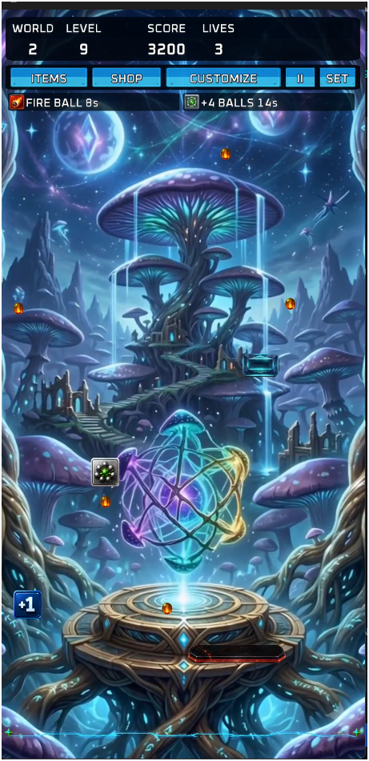

# Brick Breaker Ball

[English](README.md) | **العربية**

لعبة كسر طوب للهواتف بنظام Android، مكتوبة بلغة Kotlin وتستخدم LibGDX للرسم والمحاكاة. يعتمد المشروع على أوراق صور (Sprite Sheets) مع ملفات JSON تحدد إحداثيات كل كرة ومضرب، ثم يحولها إلى `TextureRegion` وقت التشغيل من دون استخدام Android XML أو Jetpack Compose لواجهة اللعب.

## معاينة الشكل المستهدف

<p align="center">
  
</p>

`the-game.png` صورة مرجعية مقاسها **461×951** بكسل توضح اتجاه واجهة اللعب: شريط معلومات علوي، أزرار Items وShop وCustomize، مؤثرات نشطة، خلفية عالم، منطقة لعب، مضرب وكرات وعناصر ساقطة. الصورة ليست محمّلة من كود اللعبة وليست جزءًا من أصول APK؛ وظيفتها توثيق الشكل البصري المستهدف فقط.

## خريطة عناصر اللعب المشروحة

<p align="center">
  
</p>

`spritesheet-with-notes.png` دليل بصري مشروح مقاسه **1254×1254** بكسل. يحتوي على ملاحظات عربية فوق عناصر المضارب والكرات والطوب والـPower-ups لشرح السلوك المقصود. هذه النسخة مخصصة للتوثيق والمراجعة وليست ملف تشغيل.

ملف التشغيل القياسي المقابل هو `spritesheet.png`، وتوجد خريطته في:

- `docs/sprite-map-detailed.json`
- `app/src/main/assets/sprites/sprite-map-detailed.json`

الخريطة القياسية تحتوي على **70 منطقة فريدة** داخل صورة 1254×1254:

| الفئة | العدد | الاستخدام |
|---|---:|---|
| Paddles | 3 | المضرب العادي، المسلح، واللاصق |
| Balls | 9 | ثلاث حالات للكرة × ثلاثة أحجام |
| Power-ups | 20 | أيقونات القوى الإيجابية والسلبية |
| Bricks | 28 | الطوب السليم والمتضرر والخاص |
| Effects | 8 | مؤثرات بصرية متحركة |
| Projectile | 1 | مقذوف المضرب المسلح |
| Hazard | 1 | عنصر خطر |

لا تُنقل الملاحظات البرتقالية إلى أصول التشغيل، ولا يجوز تعديل أبعاد الورقة أو ترتيب مناطقها أو إحداثياتها من دون تحديث ملف JSON والاختبارات معًا.

## أوراق المضارب

توجد ثلاثة ملفات PNG شفافة، مقاس كل واحد منها **1024×1024** بكسل. يحتوي كل ملف على 18 مضربًا موزعة إلى ستة صفوف وثلاثة أنواع في كل صف، أي **54 مضربًا** إجمالًا.

| مجموعة التشغيل | صورة المصدر | ملف الإحداثيات | العدد |
|---|---|---|---:|
| `group1` | `app/src/main/assets/sprites/paddles-sprites/paddles-group1.png` | `paddles-group1.json` | 18 |
| `group2` | `app/src/main/assets/sprites/paddles-sprites/paddles-group2.png` | `paddles-group2.json` | 18 |
| `group3` | `app/src/main/assets/sprites/paddles-sprites/paddle-group3.png` | `paddles-group3.json` | 18 |

> ملاحظة: اسم صورة المجموعة الثالثة هو `paddle-group3.png` بصيغة المفرد، بينما اسم JSON هو `paddles-group3.json`. هذا الاختلاف مقصود ومطابق لمسار التحميل الحالي.

### أنواع المضارب

كل تعريف في JSON يحمل `group.id` واحدًا من القيم التالية:

- `normal`: مضرب تجميلي عادي.
- `weapon`: شكل مضرب مسلح يُستخدم عند تفعيل حالة الليزر.
- `sticky`: شكل المضرب اللاصق عند تفعيل حالة الالتصاق.

اختيار شكل `weapon` أو `sticky` من شاشة التخصيص لا يفعّل قدرة لعب بمفرده. القدرات تُدار من نظام الـPower-ups، وعند تفعيلها يختار العرض الشكل المناسب للحالة.

المضارب الافتراضية الحالية من المجموعة الثانية:

| الحالة | المعرّف |
|---|---|
| عادي | `group2:paddle_normal_titanium_edge` |
| مسلح | `group2:paddle_weapon_dual_pulse_cannon` |
| لاصق | `group2:paddle_sticky_nano_gel` |

### معاينة المجموعات

#### المجموعة الأولى


#### المجموعة الثانية


#### المجموعة الثالثة


## ورقة الكرات التجميلية

<p align="center">
  
</p>

`balls-sprites-7.png` ورقة PNG شفافة مقاسها **1536×1024** بكسل. يصفها الملف `balls-sprites-7groups-named.json` وتحتوي على:

- **40 مجموعة** موضوعية.
- **271 كرة** ذات معرّفات فريدة.
- إحداثيات `x` و`y` وأبعاد `width` و`height` لكل كرة.
- اسم مجموعة ثابت واسم Sprite ثابت يُستخدمان في الحفظ والاستعادة.

المجموعة والكرة الافتراضيتان هما `monsters` و`monsters_skull`. من أمثلة المجموعات: الوحوش، الكواكب، الأحجار الكريمة، المعادن، الأخشاب، النار، الماء، الطقس، الفضاء، التقنية، النباتات، الحيوانات، السحر، العناصر، التنانين، الطيور، البلورات، الأبراج والحضارات.

شكل الكرة منفصل عن حجم التصادم الفيزيائي. الأحجام المنطقية الحالية هي:

| الحجم | نصف قطر التصادم |
|---|---:|
| Small | 11 |
| Default | 16 |
| Large | 22 |

لذلك لا تُستخدم أبعاد الصورة الخام كحدود تصادم. يرسم المحرك الـSprite المختار بالحجم الموافق لنصف القطر، وتحافظ الكرات المستنسخة في Multi-ball على الهوية التجميلية والحجم وحالة العنصر.

## طريقة التحميل داخل اللعبة

ينفذ `CosmeticSpriteRepository` الخطوات التالية:

1. يحمّل PNG من `app/src/main/assets/sprites/` بواسطة LibGDX.
2. يقرأ ملف JSON بترميز UTF-8.
3. يتحقق من تطابق أبعاد JSON مع الصورة ومن بقاء كل مستطيل داخل الحدود.
4. ينشئ `TextureRegion` لكل تعريف باستخدام الإحداثيات الدقيقة.
5. يستخدم ترشيح `Linear` وحدود `ClampToEdge` لتقليل التشوه عند تغيير الحجم.
6. يحفظ اختيار الكرة والمضرب بمعرّفات مستقرة، ويعود إلى القيم الافتراضية عند عدم وجود الاختيار.

المفاتيح المحفوظة للتخصيص هي `selected_ball_group` و`selected_ball_sprite` و`selected_ball_size` و`selected_paddle_id`.

## قواعد تعديل الـSprite Sheets

- لا تغيّر أبعاد الصور أو ترتيب العناصر أو الإحداثيات من دون تحديث JSON المقابل.
- يجب أن يكون لكل Sprite اسم أو معرّف فريد ومستطيل ذو أبعاد موجبة داخل حدود الصورة.
- أبقِ `spritesheet-with-notes.png` خارج `app/src/main/assets` لأنها نسخة توثيقية فقط.
- لا تستخدم الكرات الصفراء على أنها Fire Ball؛ حالة النار لها تمثيل منفصل.
- لا تربط أسماء مختلفة بالمستطيل نفسه إلا إذا كان ذلك مقصودًا وموثقًا.
- حافظ على فصل الحجم البصري عن نصف قطر التصادم.

## التحقق والبناء

من PowerShell على Windows:

```powershell
python .agents/skills/sprite-atlas-validator/scripts/validate_atlas.py `
  --image spritesheet.png `
  --manifest docs/sprite-map-detailed.json `
  --expected-count 70

.\gradlew.bat test
.\gradlew.bat lint
.\gradlew.bat assembleRelease
```

يتحقق `CosmeticCustomizationTest` من وجود 40 مجموعة و271 كرة و54 مضربًا، ومن فرادة المعرّفات وصحة الإحداثيات والحفظ والاستعادة.

## الأصول والتراخيص

تفاصيل مصادر الأصول والتراخيص موجودة في [`assets/THIRD_PARTY_ASSETS.md`](assets/THIRD_PARTY_ASSETS.md). لا تُرفع ملفات `local.properties` أو `keystore.properties` أو مفاتيح التوقيع إلى GitHub؛ وهي مستبعدة بالفعل عبر `.gitignore`.
