# BrickBreakerBall - Game Rules & Sprite Reference

## 1. Core Game Rules

- Move the paddle left and right at the bottom of the playfield.
- Return the ball with the paddle so it reaches the brick field.
- A stage ends when all bricks that count as breakable objectives have been destroyed.
- Unbreakable steel bricks normally do not count toward the stage-clear requirement.
- If the last active ball falls below the playfield, the player loses one life.
- With multiball active, a life is not lost until every active ball has been lost.
- Losing a life clears most active power-up effects, removes falling power-ups, and resets the paddle/ball to the serve state.
- Where the ball hits the paddle changes the return angle: center is straighter, left side sends it left, and right side sends it right.
- The ball gradually becomes faster during play.
- Some destroyed bricks can drop power-ups; the player may collect or avoid them.

## 2. Paddles

### Normal Paddle

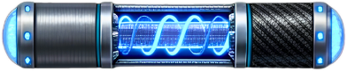

The baseline paddle. Moves left and right, returns the ball, has no built-in shooting or grabbing ability, and can be resized by power-ups.

### Laser Paddle

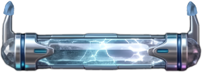

Armed paddle with two launch points. It fires Laser Projectiles upward to hit bricks. The supplied rules also describe Fire and Piercing effects being able to carry over to laser shots when those effects are active.

### Sticky / Grab Paddle

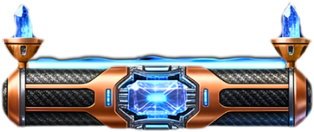

Catches a ball on contact and holds it to the paddle until the player releases it. The supplied rules allow it to hold multiple balls while multiball is active.

### Paddle Style Abilities

Every cosmetic paddle style set now has a gameplay ability. The same ability follows the style across its Normal, Weapon, and Sticky visual forms. Ability strength increases modestly on later unlocked styles.

- ==Precision Core== - Balanced control with a small paddle-response bonus. Titanium Edge is the starter example.
- ==Hyper Glide== - Faster paddle response for quick horizontal movement. Neon Wing is the first Hyper Glide style.
- ==Impact Boost== - While the ball is in play, tap just before the ball reaches the paddle. A successful timed return increases the ball's base speed. Sticky release and Laser firing keep priority over this ability. Quantum Slate is the first Impact Boost style.
- ==Inferno Rhythm== - Counts normal paddle returns. Every fourth normal return charges the ball with a one-hit fire strike. The charge is consumed by the next breakable brick it hits and does not create the full Fire Ball splash explosion. Prism Guard is the first Inferno Rhythm style.

## 3. Ball System

### Sizes

- ==Small== - Small / Shrink size. About half-size in the supplied rules; harder to return, but
better for narrow gaps.
- ==Medium== - Normal/default size and baseline handling.
- ==Large== - Large / Mega size. About twice normal size in the supplied rules; easier to return but less suitable for narrow gaps.

### Types

- ==Normal== - Standard collision behavior: the ball rebounds from the paddle, walls, and ordinary bricks.
- ==Fire== - Fire effect: the struck brick explodes and can damage nearby bricks. The supplied rules describe Fire + Piercing as compatible effects.
- ==Piercing== - Piercing / Thru-Brick effect: passes through bricks and continues moving instead of bouncing from each brick.

### All Ball Sprites

#### Small Fire Ball

- Size: ==Small==
- Type: ==Fire==
- Rule: Small / Shrink size. About half-size in the supplied rules; harder to return, but better for narrow gaps. Fire effect: the struck brick explodes and can damage nearby bricks. The supplied rules describe Fire + Piercing as compatible effects.

#### Small Normal Ball

- Size: ==Small==
- Type: ==Normal==
- Rule: Small / Shrink size. About half-size in the supplied rules; harder to return, but better for narrow gaps. Standard collision behavior: the ball rebounds from the paddle, walls, and ordinary bricks.

#### Small Piercing Ball

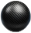

- Size: ==Small==
- Type: ==Piercing==
- Rule: Small / Shrink size. About half-size in the supplied rules; harder to return, but better for narrow gaps. Piercing / Thru-Brick effect: passes through bricks and continues moving instead of bouncing from each brick.

#### Medium Fire Ball

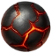

- Size: ==Medium==
- Type: ==Fire==
- Rule: Normal/default size and baseline handling. Fire effect: the struck brick explodes and can damage nearby bricks. The supplied rules describe Fire + Piercing as compatible effects.

#### Medium Normal Ball

- Size: ==Medium==
- Type: ==Normal==
- Rule: Normal/default size and baseline handling. Standard collision behavior: the ball rebounds from the paddle, walls, and ordinary bricks.

#### Medium Piercing Ball

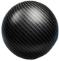

- Size: ==Medium==
- Type: ==Piercing==
- Rule: Normal/default size and baseline handling. Piercing / Thru-Brick effect: passes through bricks and continues moving instead of bouncing from each brick.

#### Large Fire Ball

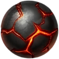

- Size: ==Large==
- Type: ==Fire==
- Rule: Large / Mega size. About twice normal size in the supplied rules; easier to return but less suitable for narrow gaps. Fire effect: the struck brick explodes and can damage nearby bricks. The supplied rules describe Fire + Piercing as compatible effects.

#### Large Normal Ball

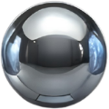

- Size: ==Large==
- Type: ==Normal==
- Rule: Large / Mega size. About twice normal size in the supplied rules; easier to return but less suitable for narrow gaps. Standard collision behavior: the ball rebounds from the paddle, walls, and ordinary bricks.

#### Large Piercing Ball

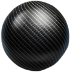

- Size: ==Large==
- Type: ==Piercing==
- Rule: Large / Mega size. About twice normal size in the supplied rules; easier to return but less suitable for narrow gaps. Piercing / Thru-Brick effect: passes through bricks and continues moving instead of bouncing from each brick.

## 4. Power-Ups / Charms

### Laser Auto-Charge

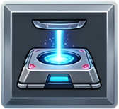

- Classification: ==Positive==
- Effect: Automatically fills the laser machine/gauge. The supplied sprite-map note says its indicator moves rapidly up and down.

### Extra Life

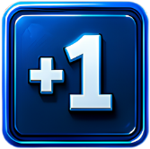

- Classification: ==Positive==
- Effect: Adds one life (+1).

### Kill Paddle

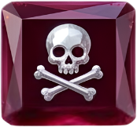

- Classification: ==Negative==
- Effect: Immediately destroys the player paddle and costs a life under the normal life-loss rules.

### Expand Paddle

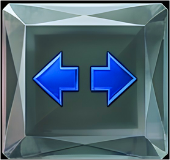

- Classification: ==Positive==
- Effect: Increases paddle width, making the ball easier to return.

### Timed Bomb Bricks

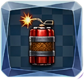

- Classification: ==Positive==
- Effect: Turns bricks hit by the ball into timed bombs. When a timed bomb detonates, it destroys nearby bricks.

### Random Positive Boost

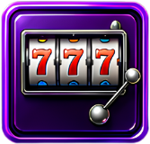

- Classification: ==Positive==
- Effect: Awards one randomly selected positive power-up.

### Shrink Ball

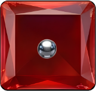

- Classification: ==Negative==
- Effect: Changes the active ball to the Small size state.

### Shrink Paddle

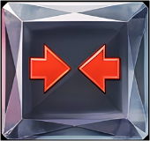

- Classification: ==Negative==
- Effect: Reduces paddle width, making returns harder.

### Fireball

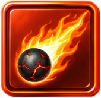

- Classification: ==Positive==
- Effect: Changes the ball to its Fire state. The Fire Ball uses the matching sprite for the ball's current size.

### Magnetic Paddle

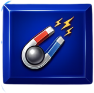

- Classification: ==Positive==
- Effect: Makes the paddle attract the ball when the ball enters its nearby magnetic range.

### Slow Ball

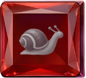

- Classification: ==Positive==
- Effect: Reduces ball movement speed.

### +4 Multiball

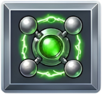

- Classification: ==Positive==
- Effect: Adds four extra playable balls to the balls already in play.

### Dual Paddle

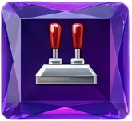

- Classification: ==Positive==
- Effect: Activates an additional paddle so the player controls two paddles.

### Fast Ball

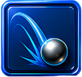

- Classification: ==Negative==
- Effect: Raises ball movement speed.

### Instant Ball Kill

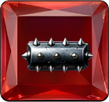

- Classification: ==Negative==
- Effect: Immediately removes the affected ball. A life is only lost when the last active ball is gone.

### Mega / Big Ball

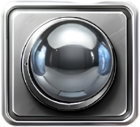

- Classification: ==Positive==
- Effect: Changes the ball to the Large size state.

### Activate Sticky Paddle

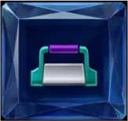

- Classification: ==Positive==
- Effect: Changes the paddle to the Sticky/Grab state. A ball that reaches it is held temporarily and can then be released by the player.

### One-Hit Breaker

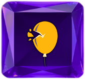

- Classification: ==Positive==
- Effect: Makes the ball destroy any brick that is allowed to be affected in one hit. Explicitly unbreakable/special exceptions remain code-defined.

### Ghost Ball

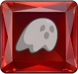

- Classification: ==Special==
- Effect: Makes the ball ghost through bricks without breaking them.

### 15-Ball Multiball

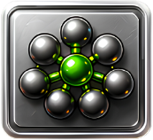

- Classification: ==Positive==
- Effect: Creates or sets a play group of 15 balls under the game's multiball system.

## 5. Bricks

### Rough Stone Brick

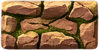

- Material: ==rough_stone==
- Impact behavior: Breakable. On impact it breaks and sends the ball back in a randomized direction because of its uneven surface.

### Lightning Speed Pass-Through Brick

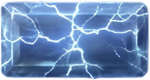

- Material: ==transparent_lightning==
- Collision mode: ==pass_through==
- Impact behavior: Pass-through brick. The ball travels through it, the brick disappears, and the ball becomes faster/lighter according to the supplied sprite-map note.

### White Electric Crystal - Intact

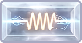

- Material: ==electric_crystal==
- Damage state: ==intact==
- Next state: ==brick_electric_white_damaged==
- Impact behavior: First normal hit changes this intact brick into White Electric Crystal - Damaged.

### Blue Crystal - Intact

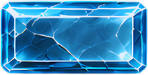

- Material: ==crystal==
- Damage state: ==intact==
- Next state: ==brick_crystal_blue_damaged==
- Impact behavior: First normal hit changes this intact brick into Blue Crystal - Damaged.

### Red Crystal - Intact

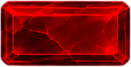

- Material: ==crystal==
- Damage state: ==intact==
- Next state: ==brick_crystal_red_damaged==
- Impact behavior: First normal hit changes this intact brick into Red Crystal - Damaged.

### Purple Crystal - Intact

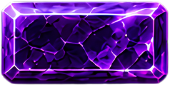

- Material: ==crystal==
- Damage state: ==intact==
- Next state: ==brick_crystal_purple_damaged==
- Impact behavior: First normal hit changes this intact brick into Purple Crystal - Damaged.

### Gray Stone - Intact

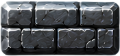

- Material: ==stone==
- Damage state: ==intact==
- Next state: ==brick_stone_gray_damaged==
- Impact behavior: First normal hit changes this intact brick into Gray Stone - Damaged.

### Black Hole Teleporter

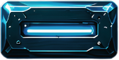

- Material: ==black_hole==
- Impact behavior: The ball enters the black hole and reappears from a random direction/side with an angle somewhere within 360 degrees. The supplied map does not specify whether the brick is consumed.

### Random Inventory Power-Up Brick

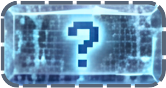

- Material: ==mystery==
- Impact behavior: Grants a random power-up and stores that reward in the Items/Inventory system. The supplied map does not specify whether the brick disappears after triggering.

### White Electric Crystal - Damaged

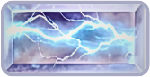

- Material: ==electric_crystal==
- Damage state: ==damaged==
- Previous state: ==brick_electric_white_intact==
- Impact behavior: Damaged state after the first hit. The next normal hit breaks it under the supplied rule description.

### Blue Crystal - Damaged

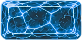

- Material: ==crystal==
- Damage state: ==damaged==
- Previous state: ==brick_crystal_blue_intact==
- Impact behavior: Damaged state after the first hit. The next normal hit breaks it.

### Red Crystal - Damaged

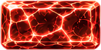

- Material: ==crystal==
- Damage state: ==damaged==
- Previous state: ==brick_crystal_red_intact==
- Impact behavior: Damaged state after the first hit. The next normal hit breaks it.

### Purple Crystal - Damaged

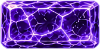

- Material: ==crystal==
- Damage state: ==damaged==
- Previous state: ==brick_crystal_purple_intact==
- Impact behavior: Damaged state after the first hit. The next normal hit breaks it.

### Gray Stone - Damaged

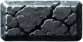

- Material: ==stone==
- Damage state: ==damaged==
- Previous state: ==brick_stone_gray_intact==
- Impact behavior: Cracked stone state after the first hit. The next normal hit breaks it.

### Unbreakable Steel Brick

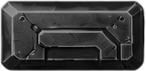

- Material: ==steel==
- Breakable by normal collision: ==No==
- Impact behavior: Does not break from a normal collision. Piercing/Thru-Brick or explosions may affect it depending on the final game rules you implement.

### MAROON Crystal - Intact

- Material: ==crystal==
- Damage state: ==intact==
- Next state: ==brick_crystal_MAROON_damaged==
- Impact behavior: First normal hit changes this intact brick into MAROON Crystal - Damaged.

### Dark Armored Brick - Intact

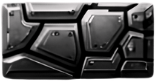

- Material: ==armored_dark==
- Damage state: ==intact==
- Next state: ==brick_armored_dark_damaged==
- Impact behavior: First normal hit changes this armored brick into Dark Armored Brick - Damaged.

### Pink Crystal - Intact

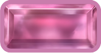

- Material: ==crystal==
- Damage state: ==intact==
- Next state: ==brick_crystal_pink_damaged==
- Impact behavior: First normal hit changes this intact brick into Pink Crystal - Damaged.

### Orange Crystal - Intact

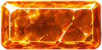

- Material: ==crystal==
- Damage state: ==intact==
- Next state: ==brick_crystal_orange_damaged==
- Impact behavior: First normal hit changes this intact brick into Orange Crystal - Damaged.

### Green Crystal - Intact

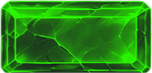

- Material: ==crystal==
- Damage state: ==intact==
- Next state: ==brick_crystal_green_damaged==
- Impact behavior: First normal hit changes this intact brick into Green Crystal - Damaged.

### Basic One-Hit Brick

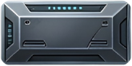

- Material: ==basic_metal==
- Hits to break: ==1==
- Impact behavior: Standard breakable brick. One normal hit destroys it.

### Spiked Hazard Brick

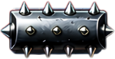

- Material: ==spiked_metal==
- Impact behavior: Special hazard brick. The sprite map marks it as a hazard, but does not define the exact collision penalty or whether it can be destroyed. That behavior remains game-code defined.

### MAROON Crystal - Damaged

- Material: ==crystal==
- Damage state: ==damaged==
- Previous state: ==brick_crystal_MAROON_intact==
- Impact behavior: Damaged state after the first hit. The next normal hit breaks it.

### Dark Armored Brick - Damaged

- Material: ==armored_dark==
- Damage state: ==damaged==
- Previous state: ==brick_armored_dark_intact==
- Impact behavior: Damaged glowing armored state. The next normal hit breaks it under the supplied balance description.

### Pink Crystal - Damaged

- Material: ==crystal==
- Damage state: ==damaged==
- Previous state: ==brick_crystal_pink_intact==
- Impact behavior: Damaged state after the first hit. The next normal hit breaks it.

### Orange Crystal - Damaged

- Material: ==crystal==
- Damage state: ==damaged==
- Previous state: ==brick_crystal_orange_intact==
- Impact behavior: Damaged state after the first hit. The next normal hit breaks it.

### Green Crystal - Damaged

- Material: ==crystal==
- Damage state: ==damaged==
- Previous state: ==brick_crystal_green_intact==
- Impact behavior: Damaged state after the first hit. The next normal hit breaks it.

### Transparent Slow Pass-Through Brick

- Material: ==transparent_energy==
- Collision mode: ==pass_through==
- Impact behavior: Pass-through brick. The ball passes through, the brick disappears, and the ball slows down.

## 6. Additional Elements

### Laser Projectile

The projectile fired upward by the Laser Paddle.

### Electric Floor Wire

Electric hazard at the bottom of the play area.

### Spark Animation

8 frames used for the spark / impact animation.
